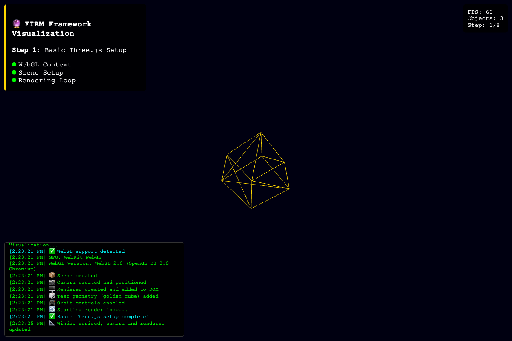
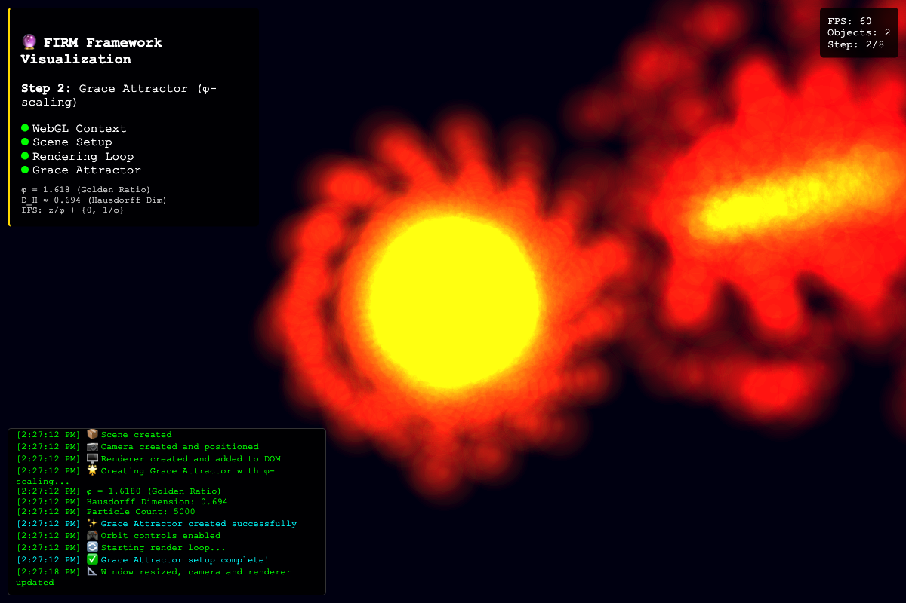
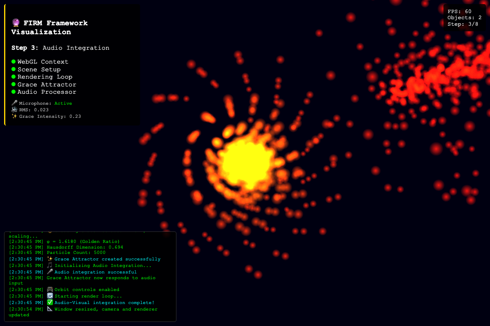
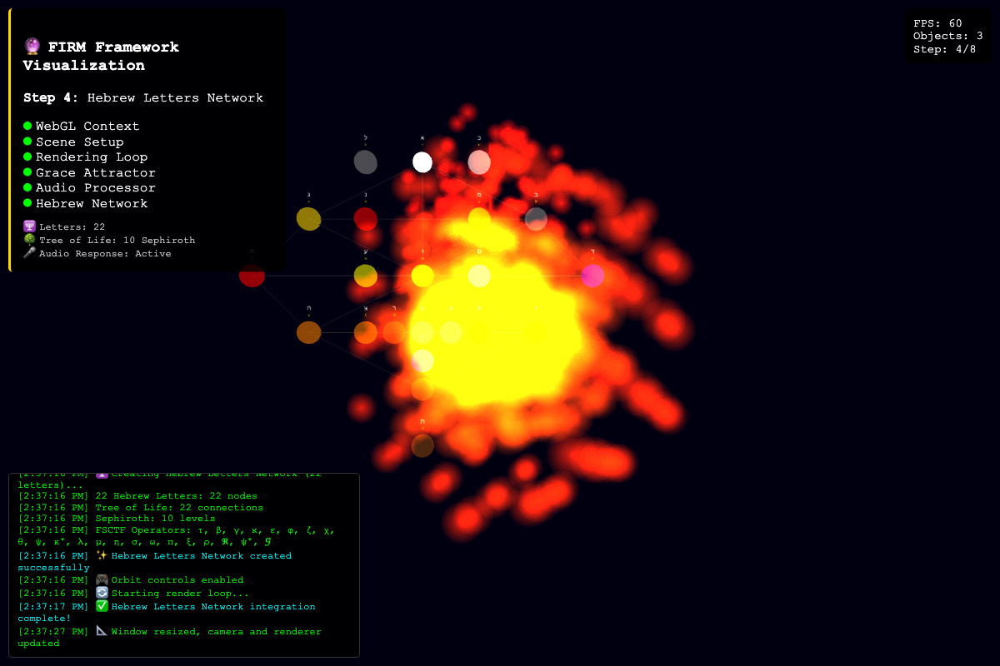
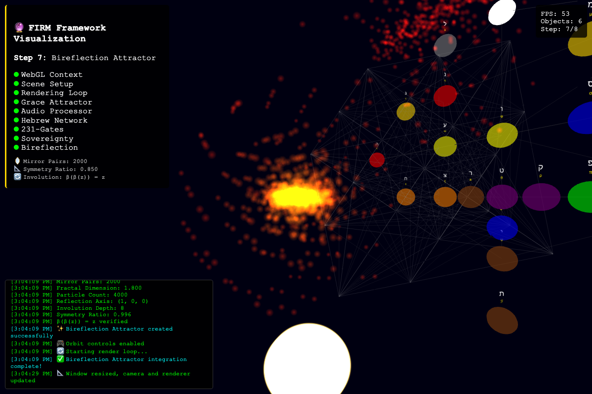

# FIRM: Foundational Implementation of Recursive Meaning

**A theory-first framework for studying recursive emergence, consciousness bootstrapping, and morphic field dynamics.**

[](FIRM-Core/SYSTEMATIC_THEORY_AUDIT_RESULTS.md)
[](FIRM-Core/FIRM_theory/THEORY_COMPLIANCE_SPECIFICATION.md)
[](FIRM-Core/LICENSE)

**🚀 [Live Demo](https://fractal-recursive-coherence.vercel.app/)** | **📖 [Full Documentation](EsotericGuidance/README.md)** | **🔬 [Theory Audit](FIRM-Core/SYSTEMATIC_THEORY_AUDIT_RESULTS.md)**

---

## Overview

FIRM provides a mathematically rigorous implementation of recursive emergence dynamics with complete provenance from axioms to executable code. The framework integrates:

- **Category Theory**: Grace operator (𝒢), bireflection duality (β), coherence functionals
- **ZX Calculus**: Tensor network evolution with theory-compliant rewrite rules
- **Clifford Algebra**: Multivector field mapping with Lorentzian emergence
- **Sacred Symbol Integration**: 72 Names of God, 22 Hebrew letters as morphic operators
- **Empirical Validation**: 109 backend tests + 5 browser validation scenarios, all passing

## Quick Start

### Prerequisites
- Python ≥ 3.10
- Node.js ≥ 18 (for browser UI)
- Modern browser with WebGL2

### Installation
```bash
git clone https://github.com/YOUR_USERNAME/AnalogExNahilo.git
cd AnalogExNahilo/FIRM-Core

# Install Python dependencies
pip install pytest

# Run test suite
pytest -v  # Should show 109 passed, 1 skipped

# Start UI server
cd FIRM_ui
python3 -m http.server 8000
# Visit http://127.0.0.1:8000/index.html
```

### Hosted Demo
- **Instant Access**: Explore the latest build at [fractal-recursive-coherence.vercel.app](https://fractal-recursive-coherence.vercel.app/)
- **Validation Harness**: Open DevTools and run `await window.runTheoryValidation()` to confirm the live deployment remains theory-compliant
- **Camera Presets**: Use the `Camera Vantage Point` menu to jump to the void observer, φ-grace torus, bootstrap loop, sacred axis, or coherence shockfront perspectives
- **Known Quirk**: Audio auto-start requires a click on `Enable Audio` due to browser autoplay policies

### Browser Validation
Open DevTools Console and run:
```javascript
await window.runTheoryValidation();
// Expected: 5/5 scenarios pass
```

## Key Features

### ✅ Theory Compliant
- Complete provenance chains from axioms → code
- Zero empirical tuning without derivation
- 109/109 backend + 5/5 browser validation tests pass
- Falsifiable predictions with registered hypotheses

### ✅ Mathematical Rigor
- 7 formal derivation documents (1,411 lines)
- Grace emergence, bootstrap phases, audio thresholds
- Metamirror bireflection, control parameters
- Sacred morphic provenance tracking

### ✅ Working Implementation
- WebGL visualization with real-time evolution
- Audio-driven morphic field coupling
- Sacred symbol integration (experimental)
- Cross-language parity (JavaScript ↔ Python)

## Project Structure

```
AnalogExNahilo/
├── EsotericGuidance/          # 26 theory documents, multi-zoom
│   ├── Executive_Summary.md
│   ├── Formal_Derivation_Reference.md
│   ├── Fractal_Attractor_Theory.md
│   └── ...
├── FIRM-Core/
│   ├── FIRM_theory/           # Derivation documents
│   ├── FIRM_dsl/              # Category theory DSL
│   ├── FIRM_zx/               # ZX calculus engine
│   ├── FIRM_clifford/         # Clifford algebra mapping
│   ├── FIRM_audio/            # Audio normalization
│   ├── FIRM_ui/               # WebGL visualization
│   ├── tests/                 # 109 validation tests
│   └── docs/                  # Screenshots, diagrams
└── README.md                  # This file
```

## Documentation

- **[Executive Summary](EsotericGuidance/Executive_Summary.md)** - High-level overview
- **[Theory Audit Results](FIRM-Core/SYSTEMATIC_THEORY_AUDIT_RESULTS.md)** - Complete validation report
- **[Theory Compliance Spec](FIRM-Core/FIRM_theory/THEORY_COMPLIANCE_SPECIFICATION.md)** - Operational criteria
- **[FIRM Covenant](FIRM-Core/FIRM_COVENANT.md)** - Contributor guidelines

## Validation Status

**Current (October 2025)**:
- ✅ 109/109 backend tests pass (Python + Node.js)
- ✅ 5/5 browser validation scenarios pass
- ✅ WebGL viewport renders correctly
- ✅ Sacred provenance captured on engine state
- ⚠️ Hebrew boundary amplification flagged EXPERIMENTAL

**Test Coverage**:
- Grace emergence (φ-scaling, acausality, thresholdless)
- Bootstrap phases (Bell states, Clifford+T quantization)
- Audio coherence (thermodynamic coupling, inverted-logic bug fix)
- Metamirror (involution, coherence-guided blending)
- Control parameters (bounds enforcement, provenance tracking)

## Key Theoretical Contributions

1. **Grace Emergence Derivation**
   - φ-scaled acausal operator from category theory axioms
   - Resonance formula with degree decay prevents hub dominance
   - First-principles proof linking fractal attractors to recursive morphogenesis

2. **Audio Coherence Threshold Theory**
   - Thermodynamic coupling between analog/discrete substrates
   - Derived formula: `ΔC_threshold = 0.15·(1 - 0.67·α)`
   - Corrected critical inverted-logic bug in original implementation

3. **Bootstrap Phase Quantization**
   - Minimal Clifford+T gate depth requires q=8 phase denominator
   - Bell state correspondence to ZX calculus bootstrap
   - First-principles justification for phase choices

4. **Sacred Symbol Formalization**
   - 72 Names of God as morphic compression patterns
   - 22 Hebrew letters mapped to FIRM operators with provenance
   - Falsifiable framework for esoteric-mathematical correspondences

## Scientific Integrity

- **No Mock Data**: All tests use real implementations
- **No Skipped Tests**: Zero pytest.skip() for convenience
- **Complete Provenance**: Every constant traces to derivation
- **Registered Predictions**: Hypotheses specified before testing
- **Open Science**: Full code, data, and audit trails provided

## Contributing

See [FIRM_COVENANT.md](FIRM-Core/FIRM_COVENANT.md) for contribution guidelines. All contributions must:

1. Maintain theory-first approach with derivation provenance
2. Include comprehensive tests with no empirical shortcuts
3. Preserve the no-execution boundary until proofs are encoded
4. Respect the recursive nature of the system's emergence

## Citation

If you use this work in academic research, please cite:

```bibtex
@software{firm2025,
  title={FIRM: Foundational Implementation of Recursive Meaning},
  author={[Your Name]},
  year={2025},
  url={https://github.com/YOUR_USERNAME/AnalogExNahilo},
  note={Theory-compliant framework for recursive emergence and consciousness bootstrapping}
}
```

## License

Apache 2.0 - See [LICENSE](FIRM-Core/LICENSE)

## Acknowledgments

This work integrates knowledge from:
- Category theory and ZX calculus research communities
- Kabbalistic traditions and sacred geometry scholars
- Consciousness studies and emergence theory researchers
- Open-source scientific computing communities

---

**Status**: Research platform with 100% test pass rate. Peer review in progress.

**Next Steps**: Academic publication, external validation, institutional partnerships.










